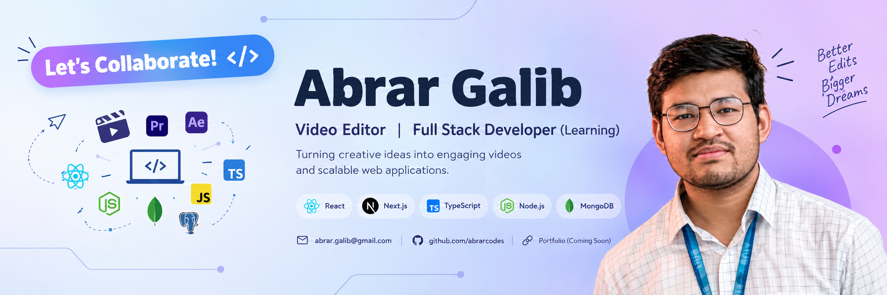

<p align="center">
  
</p>
# 👋 Hi, I'm Abrar Galib

### 🎬 Professional Video Editor | 💻 Aspiring Full-Stack Developer | 🚀 JavaScript Enthusiast

I'm a professional **Video Editor** who is currently transitioning into **Full-Stack Web Development**. I enjoy combining creativity with technology and building things that are both functional and visually engaging.

---

## 🧑‍💻 About Me

* 🎬 Professional **Video Editor** with experience in YouTube, Shorts, Reels, Motion Graphics & Visual Storytelling
* 💻 Currently learning **Full-Stack Web Development**
* 🌱 Focused on **JavaScript, TypeScript, React.js, Next.js & Tailwind CSS**
* 🔧 Exploring **Node.js, Express.js, REST APIs & Databases**
* 🚀 Building projects to strengthen my frontend and backend development skills
* 🎨 Interested in the intersection of **creative work and technology**
* 📚 Always learning and experimenting with new tools

---

## 🛠️ Tech Stack

### 💻 Frontend


### ⚙️ Backend & Database


### 🎨 Creative Tools


### 🔧 Tools


---

## 📊 GitHub Stats

<p align="center">
  
  
</p>

---

## 🔥 GitHub Streak

<p align="center">
  
</p>

---

## 🌐 Connect With Me

<p align="left">
  <a href="https://github.com/YOUR_GITHUB_USERNAME">
    
  </a>
  <a href="YOUR_LINKEDIN_URL">
    
  </a>
  <a href="YOUR_PORTFOLIO_URL">
    
  </a>
</p>

---

## 🎯 Current Focus

```text
🎬 Video Editing
       ↓
💻 JavaScript
       ↓
⚛️ React.js
       ↓
▲ Next.js
       ↓
🔷 TypeScript
       ↓
⚙️ Node.js + Express
       ↓
🗄️ Databases
       ↓
🚀 Full-Stack Development
```

---

## 💡 What I'm Working Toward

> Building my skills as a Full-Stack Developer while bringing my creative background in video editing into the world of technology.

---

<p align="center">
  <i>Thanks for visiting my profile! ⭐ Feel free to explore my repositories.</i>
</p>
